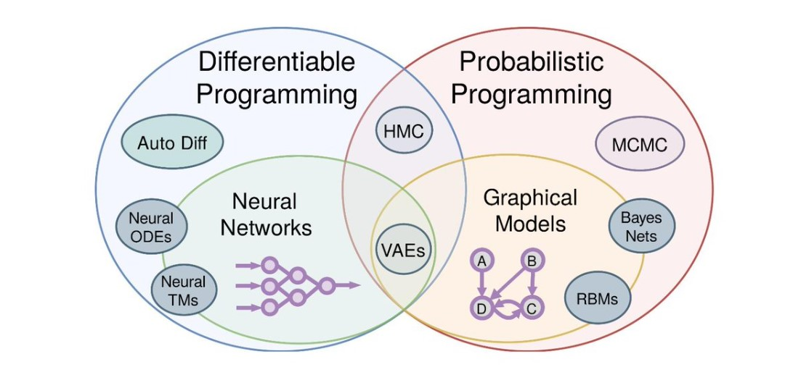

## architecture

```
+-------------------------------+
|python tensor library          |
+-------------------------------+
|c/c++ tensor library           |
+-------------------------------+
|programming language           |
+-------------------------------+
|graph ir                       | ---> task parallel
+-------------------------------+
|intermedia representation      | ---> data parallel
+-------------------------------+
|library                        |
+-------------------------------+
|openmp|mpi|opengl|opencl|cuda  |
+-------------------------------+
|os                             |
+-------------------------------+
|hardware                       |
+-------------------------------+
```

## project

- mobile
  - [tensorflow lite](https://www.tensorflow.org/lite)
  - [core ml](https://developer.apple.com/documentation/coreml)
  - [dmlc/tvm](https://github.com/dmlc/tvm)
  - [facebookresearch/TensorComprehensions](https://github.com/facebookresearch/TensorComprehensions)
  - [pytorch/glow](https://github.com/pytorch/glow)
  - [alibaba/MNN](https://github.com/alibaba/MNN)
  - [Tencent/ncnn](https://github.com/Tencent/ncnn)
  - [XiaoMi/mace](https://github.com/XiaoMi/mace)
- programming language
  - [halide/Halide](https://github.com/halide/Halide)
  - [lift-project/lift](https://github.com/lift-project/lift)
  - [skelcl/skelcl](https://github.com/skelcl/skelcl)
- graph ir
  - task parallel
    - [yahoo/TensorFlowOnSpark](https://github.com/yahoo/TensorFlowOnSpark)
    - [ray-project/ray](https://github.com/ray-project/ray)
- intermedia representation
  - [tensorflow/mlir](https://github.com/tensorflow/mlir)
    - [The LLVM Compiler Infrastructure: 2019 European LLVM Developers Meeting](https://llvm.org/devmtg/2019-04/talks.html)
    - [MLIR: Multi-Level Intermediate Representation Compiler Infrastructure](https://llvm.org/devmtg/2019-04/slides/Keynote-ShpeismanLattner-MLIR.pdf)
    - [TensorFlow Graph Optimizations](https://web.stanford.edu/class/cs245/slides/TFGraphOptimizationsStanford.pdf)    
    - [MLIR: A new intermediate representation and compiler framework](https://medium.com/tensorflow/mlir-a-new-intermediate-representation-and-compiler-framework-beba999ed18d)
  - [dmlc/HalideIR](https://github.com/dmlc/HalideIR)
- distirbuted training
  - [分布式机器学习之——Spark MLlib并行训练原理](https://zhuanlan.zhihu.com/p/81784947)
  - [一文读懂「Parameter Server」的分布式机器学习训练原理](https://zhuanlan.zhihu.com/p/82116922)
  - [Horovod知识储备：将HPC技术带入深度学习之中](https://zhuanlan.zhihu.com/p/89093128)
  - [NVIDIA/nccl](https://github.com/NVIDIA/nccl)
  - [horovod/horovod](https://github.com/horovod/horovod)
  - [bytedance/byteps](https://github.com/bytedance/byteps)

## task parallel vs data parallel

- [TensorFlow Architecture](https://github.com/tensorflow/docs/blob/master/site/en/r1/guide/extend/architecture.md)
- [Data Parallelism VS Model Parallelism in Distributed Deep Learning Training](https://leimao.github.io/blog/Data-Parallelism-vs-Model-Paralelism/)
- [Model Parallelism in Deep Learning is NOT What You Think](https://medium.com/@esaliya/model-parallelism-in-deep-learning-is-not-what-you-think-94d2f81e82ed)
- [Data parallel and model parallel distributed training with Tensorflow](http://kuozhangub.blogspot.com/2017/08/data-parallel-and-model-parallel.html)
  
## differential programming

- [可微编程：打开深度学习的黑盒子](https://www.jiqizhixin.com/articles/2018-06-08)
- [梯度下降是最好的程序员：Julia未来将内嵌可微编程系统](https://www.jiqizhixin.com/articles/2019-07-21-3)
- [Differentiable programming](https://en.wikipedia.org/wiki/Differentiable_programming)
- [What is Differentiable Programming?](https://www.quora.com/What-is-Differentiable-Programming)
- [Demystifying Differentiable Programming: Shift/Reset the Penultimate Backpropagator](https://arxiv.org/pdf/1803.10228.pdf)
- [First-Class Automatic Differentiation in Swift: A Manifesto](https://gist.github.com/rxwei/30ba75ce092ab3b0dce4bde1fc2c9f1d)

## probabilistic programming

- [Probabilistic programming](https://en.wikipedia.org/wiki/Probabilistic_programming)
- [An Introduction to Probabilistic Programming](https://arxiv.org/pdf/1809.10756.pdf)
- [Probabilistic Programming](https://simons.berkeley.edu/sites/default/files/docs/5675/talkprintversion.pdf)
- [Intro to Modern Bayesian Learning and Probabilistic Programming](https://medium.com/@Petuum/intro-to-modern-bayesian-learning-and-probabilistic-programming-c61830df5c50)
- [tensorflow/probability](https://github.com/tensorflow/probability)
- [blei-lab/edward](https://github.com/blei-lab/edward)
- [Introducing TensorFlow Probability](https://medium.com/tensorflow/introducing-tensorflow-probability-dca4c304e245)
- [An introduction to probabilistic programming, now available in TensorFlow Probability](https://medium.com/tensorflow/an-introduction-to-probabilistic-programming-now-available-in-tensorflow-probability-6dcc003ca29e)
- [CamDavidsonPilon/Probabilistic-Programming-and-Bayesian-Methods-for-Hackers](https://github.com/CamDavidsonPilon/Probabilistic-Programming-and-Bayesian-Methods-for-Hackers)

## differential programming vs probabilistic programming

