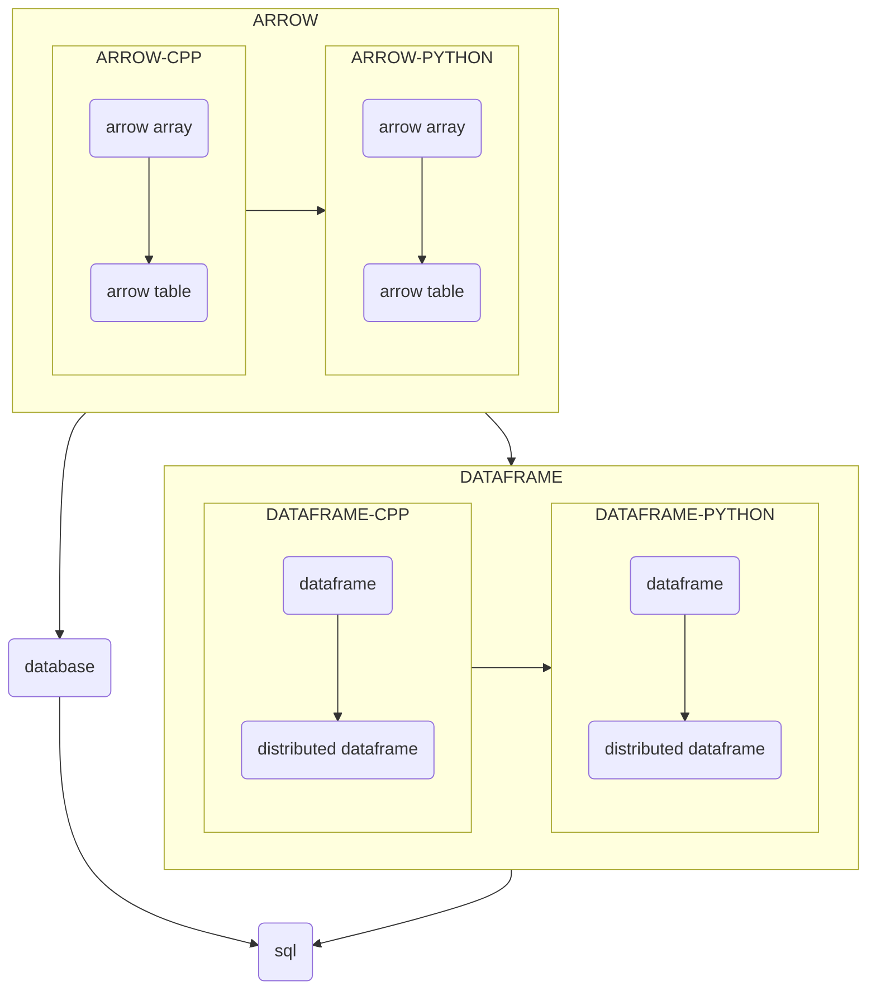

# cpp

## overview



## open source

| | standalone | distributed |
|-|------------|-------------|
| [numpy](https://github.com/numpy/numpy) | x | |
| [cupy](https://github.com/cupy/cupy) | x | |
| [vaex](https://github.com/vaexio/vaex) | x | |
| [cudf](https://github.com/rapidsai/cudf) | x | |
| [pandas](https://github.com/pandas-dev/pandas) | x | |
| [modin](https://github.com/modin-project/modin) | x | x |
| [dask](https://github.com/dask/dask) | x | x |
| [mars](https://github.com/mars-project/mars) | x | x |
| [xorbits](https://github.com/xprobe-inc/xorbits) | x | x |

## pandas

### internal structure

- code

```python
import pandas as pd

print("=========== internal ===========")
d = {'col1': [1, 2], 'col2': [3, 4], 'col3': ["5", "6"]}
df = pd.DataFrame(data=d)
print(df)
print()

mgr = df._mgr
for block in mgr.blocks:
    print(block.values)
print(mgr.arrays)
print(mgr.column_arrays)
print("================================")
print()

print("=========== internal ===========")
d = {'col1': [1, 3, "5"], 'col2': [2, 4, "6"]}
df = pd.DataFrame(data=d)
print(df)
print()
mgr = df._mgr
for block in mgr.blocks:
    print(block.values)
print(mgr.arrays)
print(mgr.column_arrays)
print("================================")
print()
```

- output

```
=========== internal ===========
   col1  col2 col3
0     1     3    5
1     2     4    6

[[1 2]
 [3 4]]
[['5' '6']]
[array([[1, 2],
       [3, 4]], dtype=int64), array([['5', '6']], dtype=object)]
[array([1, 2], dtype=int64), array([3, 4], dtype=int64), array(['5', '6'], dtype=object)]
================================

=========== internal ===========
  col1 col2
0    1    2
1    3    4
2    5    6

[[1 3 '5']
 [2 4 '6']]
[array([[1, 3, '5'],
       [2, 4, '6']], dtype=object)]
[array([1, 3, '5'], dtype=object), array([2, 4, '6'], dtype=object)]
================================
```

- conclusion

Pandas will 

1. infer type for each column
2. merge column into block with same type, which is `np.array`
3. construct blocks into mgr

### arrow

Arrow only support conversion between pandas dataframe and pyarrow table.

### open source

- [numpy/numpy](https://github.com/numpy/numpy)
- [scipy/scipy](https://github.com/scipy/scipy)
- [pandas-dev/pandas](https://github.com/pandas-dev/pandas)
- [matplotlib/matplotlib](https://github.com/matplotlib/matplotlib)
- [scikit-learn/scikit-learn](https://github.com/scikit-learn/scikit-learn)
- [opencv/opencv](https://github.com/opencv/opencv)
- [python-pillow/Pillow](https://github.com/python-pillow/Pillow)
- [uploadcare/pillow-simd](https://github.com/uploadcare/pillow-simd)

### reference

- [Internals](https://pandas.pydata.org/docs/development/internals.html)
- [wesm/pandas2](https://github.com/wesm/pandas2)
- [Internal Structure of Pandas DataFrames](https://dkharazi.github.io/blog/blockmanager)
- [Pandas Integration](https://arrow.apache.org/docs/python/pandas.html)

