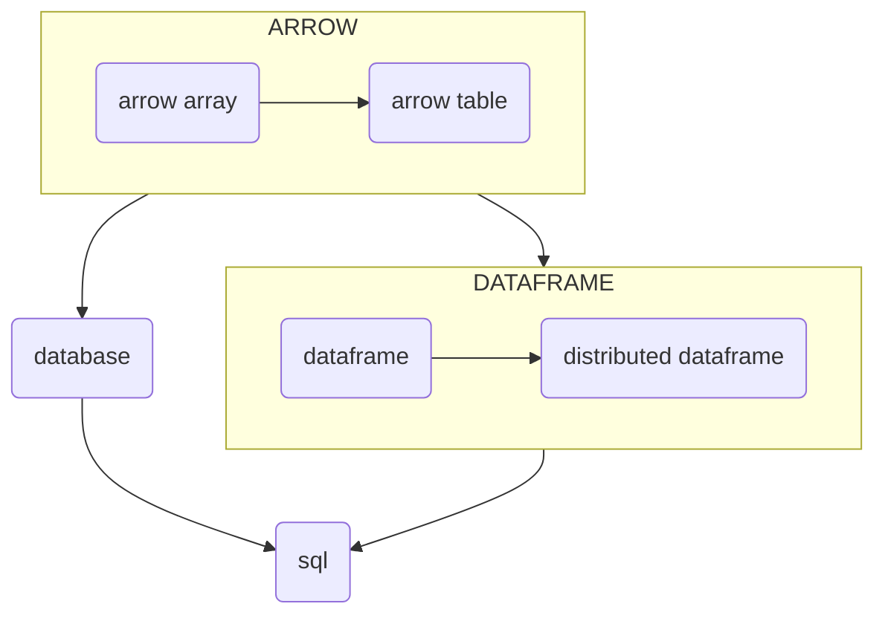

# golang

## overview

## open source

| | standalone | distributed |
|-|------------|-------------|
| [gonum/gonum](https://github.com/gonum/gonum) | x | |
| [go-gota/gota](https://github.com/go-gota/gota) | x | |
| [rocketlaunchr/dataframe-go](https://github.com/rocketlaunchr/dataframe-go) | x | |
| [tobgu/qframe](https://github.com/tobgu/qframe) | x | |
| [kfultz07/go-dataframe](https://github.com/kfultz07/go-dataframe) | x | |
| [AdikaStyle/go-df](https://github.com/AdikaStyle/go-df) | x | |
