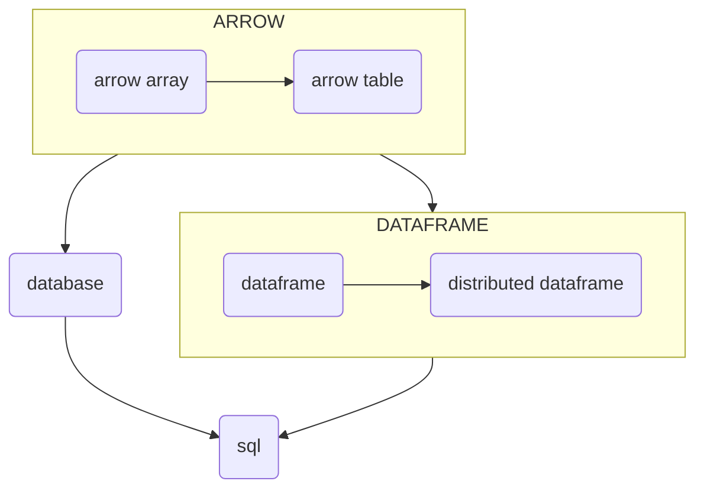

# java

## overview

```mermaid
flowchart TD;
  subgraph ARROW
  A(arrow array)
  B(arrow table)
  A --> B
  end

  subgraph DATAFRAME
  C(dataframe)
  D(distributed dataframe)
  C --> D
  end

  E(database)
  F(sql)
  
  ARROW --> DATAFRAME
  ARROW --> E
  DATAFRAME --> F
  E --> F
```

## open source

| | standlone | distributed |
|-|-----------|-------------|
| spark / flink | | x |
