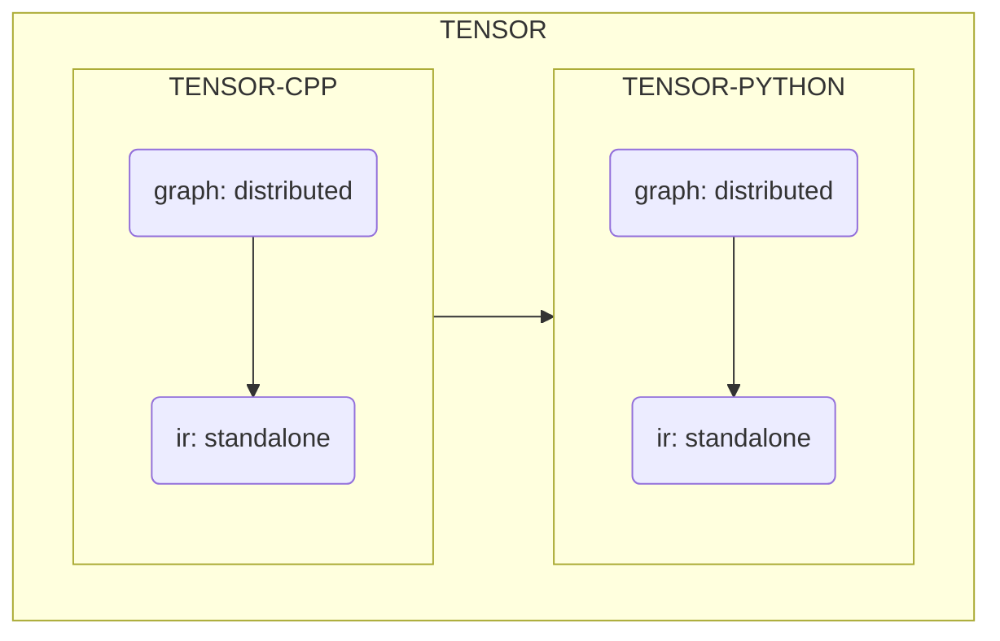

# overview

## overview

## awesome

- [HuaizhengZhang/Awesome-System-for-Machine-Learning](https://github.com/HuaizhengZhang/Awesome-System-for-Machine-Learning)
- [MLsys各方向综述](https://zhuanlan.zhihu.com/p/104444471)

## open source

### symbolic programming

- [sympy/sympy](https://github.com/sympy/sympy)
- [aesara-devs/aesara](https://github.com/aesara-devs/aesara)
- [Theano/Theano](https://github.com/Theano/Theano)

### probabilistic programming

- [Probabilistic programming](https://en.wikipedia.org/wiki/Probabilistic_programming)
- [An Introduction to Probabilistic Programming](https://arxiv.org/pdf/1809.10756.pdf)
- [Probabilistic Programming](https://simons.berkeley.edu/sites/default/files/docs/5675/talkprintversion.pdf)
- [Intro to Modern Bayesian Learning and Probabilistic Programming](https://medium.com/@Petuum/intro-to-modern-bayesian-learning-and-probabilistic-programming-c61830df5c50)
- [Introducing TensorFlow Probability](https://medium.com/tensorflow/introducing-tensorflow-probability-dca4c304e245)
- [An introduction to probabilistic programming, now available in TensorFlow Probability](https://medium.com/tensorflow/an-introduction-to-probabilistic-programming-now-available-in-tensorflow-probability-6dcc003ca29e)
- [tensorflow/probability](https://github.com/tensorflow/probability)
- [blei-lab/edward](https://github.com/blei-lab/edward)
- [pyro-ppl/pyro](https://github.com/pyro-ppl/pyro)
- [pyro-ppl/numpyro](https://github.com/pyro-ppl/numpyro)
- [pymc-devs/pymc](https://github.com/pymc-devs/pymc)
- [CamDavidsonPilon/Probabilistic-Programming-and-Bayesian-Methods-for-Hackers](https://github.com/CamDavidsonPilon/Probabilistic-Programming-and-Bayesian-Methods-for-Hackers)

### deep learning

- [tensorflow/tensorflow](https://github.com/tensorflow/tensorflow)
- [pytorch/pytorch](https://github.com/pytorch/pytorch)
- [Oneflow-Inc/oneflow](https://github.com/Oneflow-Inc/oneflow)
