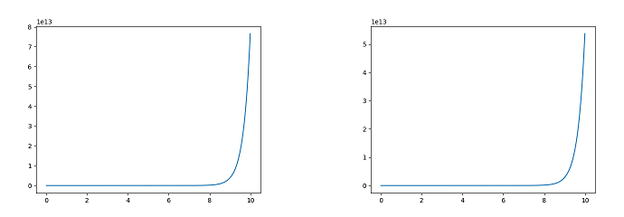
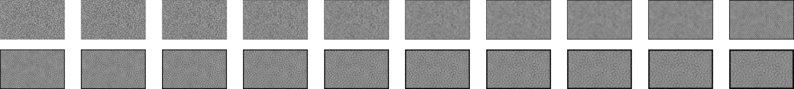
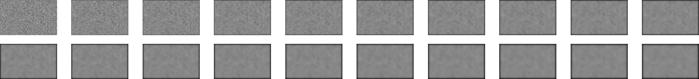

## ode

## wave equation

## heat equation

## image processing by wave equation

## image processing by heat equation

## reference

- [Solving Partial Differential Equations with TensorFlow](http://www.iitk.ac.in/hpc4se/downloads/Tensorflow-MvsdsA.pdf)
- [tensorflow/examples/community/en/pdes.ipynb](https://github.com/tensorflow/examples/blob/master/community/en/pdes.ipynb)
- [Deep dive into Tensorflow example “Partial Differential Equations”](https://colab.research.google.com/github/r7vme/tensorflow-example-pdes/blob/master/pdes.ipynb)
- [Image Processing using Partial Differential Equations (PDE)](https://www.lri.fr/~gcharpia/VisionSeminar/slides/2014-04-02-kornprobst-vist.pdf)
- [Is there a convolution function in Tensorflow to apply a Sobel filter?](https://stackoverflow.com/questions/35565312/is-there-a-convolution-function-in-tensorflow-to-apply-a-sobel-filter)
- [Tensorflow 2D convolution on RGB channels separately?](https://stackoverflow.com/questions/55687616/tensorflow-2d-convolution-on-rgb-channels-separately)